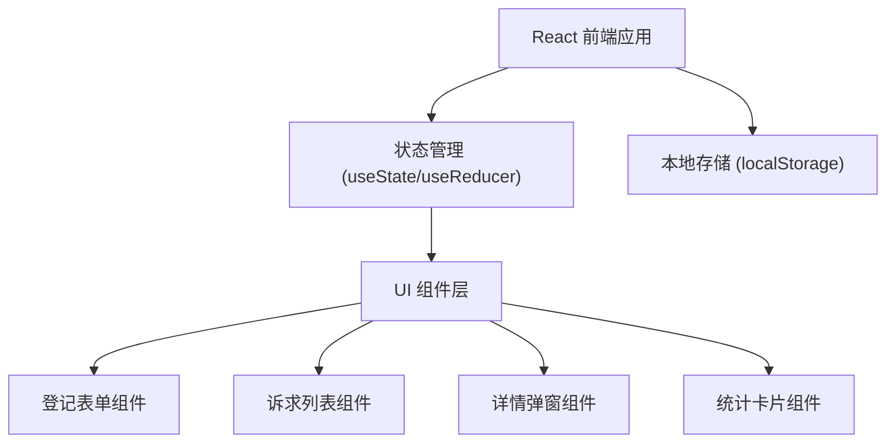

## 1. 架构设计



## 2. 技术描述

- **前端**：React@18 + TypeScript + tailwindcss@3
- **构建工具**：Vite
- **状态管理**：React Hooks (useState, useEffect)
- **数据持久化**：localStorage（单机版，数据存储在浏览器本地）
- **图标**：Lucide React
- **后端**：无（纯前端单机应用）
- **数据库**：无（使用 localStorage + mock 数据）

## 3. 组件结构

| 组件名 | 路径 | 职责 |
|--------|------|------|
| App | src/App.tsx | 主应用容器，数据管理，状态协调 |
| Header | src/components/Header.tsx | 顶部标题和统计概览 |
 ComplaintForm | src/components/ComplaintForm.tsx | 诉求登记表单 |
| ComplaintList | src/components/ComplaintList.tsx | 诉求列表（含标签页切换、搜索） |
| ComplaintCard | src/components/ComplaintCard.tsx | 单条诉求卡片 |
| DetailModal | src/components/DetailModal.tsx | 详情及处理弹窗 |
| StatusBadge | src/components/StatusBadge.tsx | 状态标签组件 |

## 4. 数据模型

### 4.1 诉求数据结构

```typescript
interface Complaint {
  id: string;
  name: string;           // 群众姓名
  phone: string;          // 联系方式
  type: string;           // 诉求类型
  content: string;        // 具体内容
  source: string;         // 来源渠道
  receiveTime: string;    // 受理时间
  status: 'pending' | 'processing' | 'replied';  // 状态：待处理/处理中/已回复
  handleOpinion: string;  // 处理意见
  replyTime: string;      // 回复时间
  createdAt: string;      // 创建时间
  updatedAt: string;      // 更新时间
}
```

### 4.2 诉求类型枚举

- 投诉
- 建议
- 咨询
- 求助
- 其他

### 4.3 来源渠道枚举

- 来电
- 来访
- 网上留言
- 微信公众号
- 上级转办
- 其他

### 4.4 状态枚举

| 状态值 | 显示名 | 颜色 |
|--------|--------|------|
| pending | 待处理 | 红色/橙色 |
| processing | 处理中 | 蓝色 |
| replied | 已回复 | 绿色 |

## 5. 核心功能实现

### 5.1 数据持久化
- 使用 localStorage 存储诉求数据
- 页面加载时从 localStorage 读取
- 数据变更时自动保存到 localStorage

### 5.2 表单验证
- 姓名：必填
- 联系方式：必填，简单格式校验
- 诉求类型：必选
- 具体内容：必填
- 来源渠道：必选
- 受理时间：必填，默认当前时间

### 5.3 列表筛选
- 按状态筛选（三个标签页）
- 搜索功能（按姓名、内容模糊匹配）
- 按时间排序（默认倒序）

### 5.4 Mock 数据
- 预置 8-10 条不同状态的示例数据
- 涵盖各种诉求类型和来源渠道
